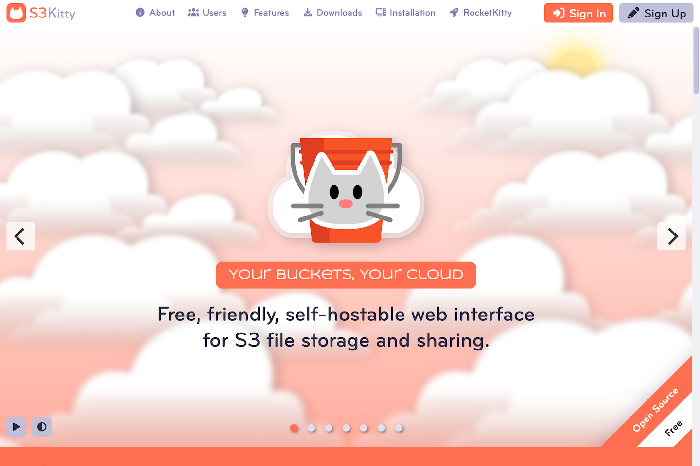

	

# S3Kitty

S3Kitty is a cloud-based web interface for managing S3 data. It combines the capacity of S3 with the familiar look and feel of your desktop or mobile OS. Best of all, you can run it on your own server.

Welcome Screen

Desktop

## Features

- Manage your buckets - Organize your files into folders.
- Share your bucket files - Share files by link, shared folder, or email.
- Easy to install - with a one-step Docker installation.
- Easy to use - works like the desktop and mobile systems you already know.
- Customizable - by users and site administrators.
- Platform independent - desktop or mobile.
- Self-hostable - run on your own server.

## Benefits

- Keep your buckets organized and accessible.
- Share bucket files with friends, family, or colleagues without giving out your bucket credentials.
- Set up is quick and painless.
- Spend your time using instead of learning how to use the platform.
- Personalize your S3Kitty user experience.
- Run on any connected device.
- Take back control over your data from the tech giants.

## Live Demo

You can create an account and explore the features and benefits of the platform at [www.s3kitty.org](https://www.s3kitty.org).

## Installation

Please follow the instructions in [www.s3kitty.org/#installation](https://www.s3kitty.org/#installation) to install the software on your computer or web server.

## Instructions

See the [Sharedigm User Guide](https://www.sharedigm.com/#help) for instructions on how to use the platform.

## License

Distributed under the IndieSource License which allows unrestricted use of the software except by very large corporations. See [LICENSE.md](LICENSE.md) for more information.

## Contact

mailto:admin@sharedigm.com
